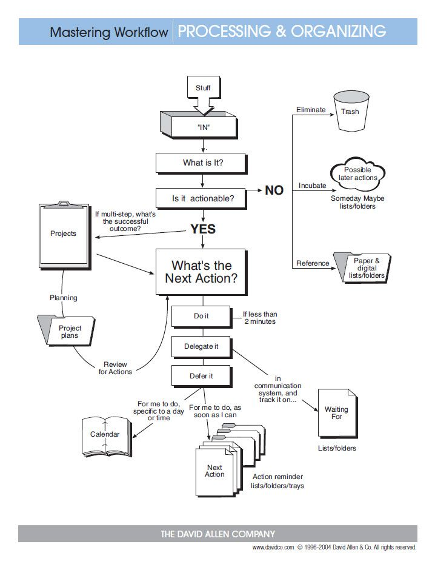

---
title:
- GTD with Taskwarrior
author:
- Thomas Willis
theme:
- Warsaw
colortheme:
- dolphin
---
# **GTD**

Getting Things Done (abbreviated to G.T.D.) is a time management method, described in the book of the same title by productivity consultant David Allen.
The GTD method rests on the idea of moving planned tasks and projects out of the mind
 by recording them externally and then breaking them into actionable
work items.  This allows attention to be focused on taking action on
tasks, instead of  recalling them. [^1]

# **Taskwarrior**

Taskwarrior is an open-source, cross platform time and task management tool. It has a command-line interface rather than a graphical user interface.
Taskwarrior uses concepts and techniques described in Getting Things Done by David Allen, but is paradigm-agnostic in that it does not require users to adhere to any given life-management philosophy.  According to its author, Taskwarrior was created "to address layout and feature issues" in the Todo.txt applications popularized by Gina Trapani [^2]

# **This Project:**

This projects uses templates produced by Tom Sydney Kerckhove in a series of blog posts (https://cs-syd.eu/tags/Taskwarrior) about integrating taskwarrior into a specific GTD workflow, modifying reports and creating scripts that are built upon the GTD concepts of:

* Collection
* Clarifying
* Organize
* Reflect
* Engage

# **How it Works**

# **Taskwarrior Definitions:**
There are several components included in Taskwarrior to allow for granular organization.

These are:

* Filters
* Tags
* Reports
* Contexts
* UDA's

# **Customizations:**
I have created some of my own reports and aliases to meet my personal GTD needs.  The goal was to accomplish these steps as organically as possible without breaking stride in daily life.  If the process is too complicated it will be quickly discarded or ignored.

# **Suggestions:**
 The use of **tasksh** with the 'review' command is a great way of doing a GTD weekly review.

 The system also integrates with the **MUTT** email client and the script **Mutt2task**.

**Taskopen** is script that opens urls referenced with a task

# **Work flow**

* Throughout the day collect stuff with the 'IN' command
* Each Morning clear *IN* by adding contexts, tags, and projects as well as assigning *Next Actions*.
* If a task can be completed in less than two minutes in the present context, **DO IT**.
* Check Projects to see if **next actions** have been completed.
* Mark completed tasks as **done**.
* Assign new  **NEXT** action.
* Throughout the day modify filter by **Context, Estimated Time, Energy Required**.  In this order.

# **Syncing**
The free online cloud Service **Freecinc** offer a nearly painless interface and setup for syncing Taskwarrior data between devices.

# **Mobile Life**
I use this same setup for collection and reflection on the go with my **Android** phone running **Termux**.

# **Questions?**

* https://taskwarrior.org
* https://gettingthingsdone.com
* https://freecinc.com
* email hamlinux@gmail.com
* github https://github.com/hamlinux/taskwarrior-GTD

[^1]:https://en.wikipedia.org/wiki/Getting_Things_Done
[^2]:https://en.wikipedia.org/wiki/Taskwarrior

